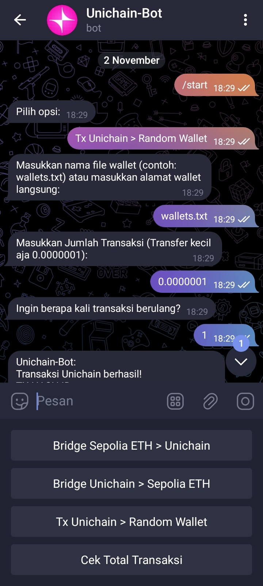

# Bot Telegram Testnet Unichain, Bridge antara Sepolia dan Unichain, serta melakukan transaksi dari Unichain ke wallet orang lain.

Proyek ini adalah skrip Node.js yang memungkinkan pengguna untuk melakukan transaksi antara jaringan Sepolia dan Unichain. Anda dapat melakukan bridging dari Sepolia ke Unichain dan sebaliknya, serta mengirim Unichain ke alamat wallet lain..

## Fitur

- **Bridge Sepolia ETH ke Unichain**
- **Bridge Unichain ke Sepolia ETH**
- **Kirim Unichain ke alamat wallet lain**
- **Cek Total Transaksi**
- **Bukti Transaksi**
- **Pengaturan jumlah transaksi dan durasi**



## Persyaratan

Sebelum menjalankan proyek ini, pastikan Anda telah menginstal:

- Node.js
- npm (Node Package Manager)

## Instalasi

1. **Clone repository ini:**

    ```bash
    git clone https://github.com/wrightL-dev/UNICHAIN2-BOT
    cd UNICHAIN2-BOT
    ```

2. **Instal paket yang diperlukan:**

    ```bash
    npm install node-telegram-bot-api web3 dotenv axios fs uuid child_process
    ```

3. **Buat file `.env` dan tambahkan konfigurasi berikut:**

    ```plaintext
   SEPOLIA_RPC_URL=https://ethereum-sepolia-rpc.publicnode.com
    UNICHAIN_RPC_URL=https://sepolia.unichain.org/
    SENDER_ADDRESS=<WALLET ADDRESS>
    PRIVATE_KEY=<PRIVATE KEY ADDRESS KALIAN>
    TELEGRAM_BOT_TOKEN=<API BOT, BUAT DI @BotFather>
    CHAT_ID=<ID TELEGRAM>
 Note: Hapus < dan > Jangan Lupa
 
4. **node main.js**

## Penggunaan

Setelah menjalankan skrip, Anda akan disajikan dengan menu untuk memilih opsi yang diinginkan:

1. **Bridge Sepolia ETH > Unichain**
2. **Bridge Unichain > Sepolia ETH**
3. **Kirim Ke Wallet Orang Lain**
4. **Cek Total Transaksi**
5. **Keluar**

Jika Anda ingin mengirim Unichain ke banyak wallet, Anda bisa mengubah isi file `wallets.txt` untuk menambahkan alamat wallet yang diinginkan. Pastikan setiap alamat wallet ditulis pada baris terpisah. Ikuti petunjuk yang ada untuk melakukan transaksi yang diinginkan.

## Dukungan

Jika Anda memiliki pertanyaan atau butuh bantuan lebih lanjut, silakan bergabung dengan saluran Telegram kami di [t.me/tahuri01](https://t.me/tahuri01).

## Lisensi

Proyek ini dilisensikan di bawah [MIT License](LICENSE).
